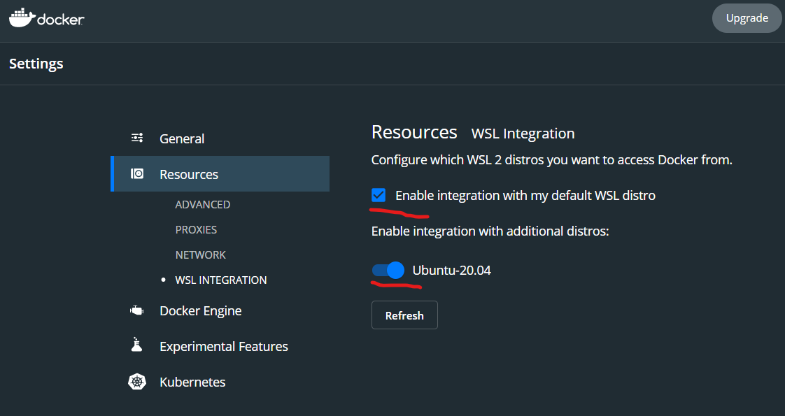

# Hurado

NOI.PH's Online Judge

## Development

### Recommended Specs

- RAM: 8 GB or more
- CPU: Intel i3 or better

### Getting Started

If you're using Windows, we recommend [using WSL 2](https://learn.microsoft.com/en-us/windows/wsl/install) to emulate a Unix environment. If you haven't yet, [set up your own SSH-key and add it to your SSH-agent](https://docs.github.com/en/authentication/connecting-to-github-with-ssh/generating-a-new-ssh-key-and-adding-it-to-the-ssh-agent).

#### Fork the repository

Fork the Hurado repository with the help of [this guide](https://docs.github.com/en/get-started/quickstart/fork-a-repo).

#### Clone your fork of the repository

Before cloning your fork of the repository, make sure that you have added your SSH-key to your SSH-agent. You can clone the repository by running the following command:

```shell
$ git clone git@github.com:your_username/hurado.git
```

#### Setup Docker

Download the [installer for Docker](https://docs.docker.com/desktop/release-notes/#docker-desktop-430) and install it. If you're using WSL 2, enable the following options: 

## Running the Web Server

1. Move to the `hurado` directory (`cd hurado`)
2. Run the code below. Don't worry about the version of your NodeJS, this environment was set up so that the Docker container works it out for you.

```shell
$ . scripts/run-backend.sh
```

3. After a bunch of messages, you'll eventually see the following:

```shell
hurado-backend  | [INFO] 08:44:45 ts-node-dev ver. 1.1.8 (using ts-node ver. 9.1.1, typescript ver. 4.6.4)
hurado-backend  | Server running on port 4000
```

4. If you haven't yet, run the following:

```shell
$ . scripts/migration-run.sh
$ . scripts/seed.sh
```

5. Visit https://localhost:4000 and you'll see "💊 RESTful API boilerplate." You could also play around with the API at https://localhost:4000/doc

### Useful Web Server Scripts

`. scripts/backend-bash.sh` - Get a bash shell into the web server. Useful for installing or updating dependencies through `npm install`, as well as random debugging.

`. scripts/frontend-bash.sh` - Get a bash shell into the web client. Useful for installing or updating dependencies through `npm install`, as well as random debugging.

`. scripts/sql.sh` - Get into a psql shell on the hurado-postgres container.

`. scripts/migration-revert.sh` - Revert the lastest migration.

`. scripts/migration-run.sh` - Run all the migrations in `web-server/src/orm/migrations`.

`. scripts/seed.sh` - Seed the database with dummy data.

`. scripts/openapi-generate.sh` - Generate OpenAPI types for both the web client and server.

## Running the Web Client

1. Move to the `hurado` directory, if you aren't there already (`cd hurado`)
2. Run the code below. Don't worry about the version of your NodeJS, this environment was set up so that the Docker container works it out for you.

```shell
$ . scripts/run-frontend.sh
```

3. After a bunch of messages, you'll eventually see the following:

```shell
hurado-frontend  | ready - started server on 0.0.0.0:3000, url: http://localhost:3000
```

4. Visit https://localhost:3000 to view the web client!

## Contribution Workflow

1. Follow the above instructions regarding forking, cloning, and running this repository.
2. Add and commit your changes to the repository. Don't forget to add your name to the [Contributors](#contributors) section below.
4. Submit a Pull Request and tag one of the contributors to review your code.
5. Wait for the review and address the comments.
6. Wait for the reviewer to approve your PR.
7. Merge your PR.

## Contributors

- Lead: [Payton Yao](https://github.com/jabbawookiees)
- [Franz Cesista](https://github.com/leloykun)
- [Cisco Ortega](https://github.com/gfmortega)
- [Neomi Mendoza](https://github.com/nimendoza)
- [Kian Chua](https://github.com/Quantum-K9)
- [Troy Serapio](https://github.com/tdserapio)
- [Angelu Garcia](https://github.com/devByGelu)
- [The Boy (alias)](https://github.com/RedBlazerFlame)
- [Davis Magpantay](https://github.com/dexva)
