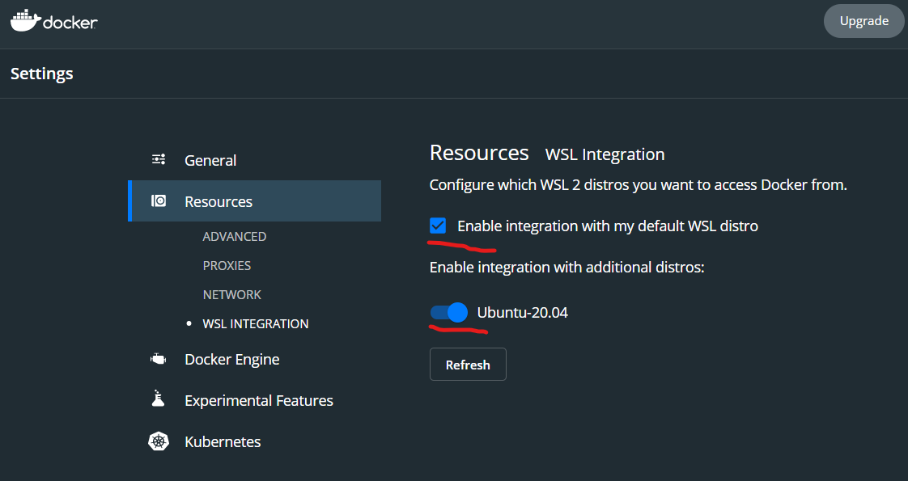

# Hurado

NOI.PH's Online Judge

[](https://github.com/pre-commit/pre-commit)

## Development

### Recommended Specs

- RAM: 8 GB or more
- CPU: Intel i3 or better

### Getting Started

#### Clone the repository

You can clone the repository by running the following commands:

```shell
cd ~/
git clone https://github.com/noiph/hurado.git
```

#### Pre-commit hooks

To setup git pre-commit hooks, first install [pre-commit](https://pre-commit.com/#install) then install our custom hooks:

```shell
pip3 install pre-commit
pre-commit install
```

You can try if your installation is working by running the linters for all files in the repo:

```shell
pre-commit run --all-files
```

This will automatically fix trivial errors enforced by the linters and show information on the non-trivial ones as well.

#### Setup Docker

Download the [installer for Docker](https://docs.docker.com/desktop/release-notes/#docker-desktop-430) and install it. If you're using WSL 2, enable the following options: 

#### Reinstall JQ, NodeJS, and Yarn

To install JQ, just run:

```shell
sudo apt install jq
```

Then, update NodeJS by running the following:

```shell
# uninstall NodeJS first
sudo apt remove nodejs npm
# update and upgrade linux
set -u
sudo apt update
sudo apt upgrade
# download setup
# replace $version with the latest stable version of NodeJS
# e.g. curl -fsSL https://deb.nodesource.com/setup_14.x | sudo -E bash -
curl -fsSL https://deb.nodesource.com/setup_$version.x | sudo -E bash -
# install nodejs again
sudo apt install -y nodejs
```

Finally, install yarn from npm

```shell
npm install --global yarn
```

## Running the Web Server

1. Move to the `web-server` directory (`cd web-server`)
2. Run `npm run servers`
3. Wait a few minutes for it to download needed stuff. You should get a bunch of messages like:

```bash
# This is downloading the necessary images from the internet
Pulling db_postgres (postgres:14-bullseye)...
...
Status: Downloaded newer image for node:16-bullseye
...
# This is building the web-server specific image
Step 5/9 : RUN npm install && npm cache clean --force
 ---> Running in 8e1211058803
...
Creating postgres ... done
Creating backend      ... done
...
# This is the postgresql image running
postgres         | 2022-07-31 08:44:36.706 UTC [1] LOG:  listening on IPv4 address "0.0.0.0", port 5432
postgres         | 2022-07-31 08:44:36.706 UTC [1] LOG:  listening on IPv6 address "::", port 5432
...
# This is web-server running
backend         | [INFO] 08:44:45 ts-node-dev ver. 1.1.8 (using ts-node ver. 9.1.1, typescript ver. 4.6.4)
backend         | Server running on port 4000
backend         | Database connection success. Connection name: 'default' Database: 'hurado'
```

Once you see that final Server running on port 4000, that means your server is running. You can test it by opening your browser and going to localhost:4000 and you should see this "💊 RESTful API boilerplate"

## Running the Web Client

1. Move to the web-client directory and run npm install
2. Wait a few minutes for it to install.
3. Run npm run dev and it should work.

You should see this message:

`ready - started server on 0.0.0.0:3000, url: http://localhost:3000`

## Useful backend commands

`npm run servers` - Run all the necessary servers

`npm run backend:bash` - Get a bash shell into the backend server. Useful for updating npm via `npm install` and random debugging

`npm run sql` - Get into a psql shell on the postgres server.

`npm run migration:run` - Run all the migrations to the latest version

`npm run migration:revert` - Revert the last migration

`npm run backend:seed` - Seed the database with dummy data

Note that as far as TypeORM is concerned, the seed scripts are also migrations.

## Contribution Workflow

1. Fork the repository.
2. Clone this repository into your local machine using `https://github.com/[your user name]/hurado.git`
3. Add and commit your changes to the repository. Don't forget to add your name to the [Contributors](#contributors) section below.
4. Submit a Pull Request and tag one of the contributors to review your code.
5. Wait for the review and address the comments.
6. Wait for the reviewer to approve your PR.
7. Merge your PR.

## Contributors

- Lead: [Payton Yao](https://github.com/jabbawookiees)
- [Franz Cesista](https://github.com/leloykun)
- [Cisco Ortega](https://github.com/gfmortega)
- [Neomi Mendoza](https://github.com/nimendoza)
- [Kian Chua](https://github.com/Quantum-K9)
- [Troy Serapio](https://github.com/tdserapio)
- [Angelu Garcia](https://github.com/devByGelu)
- [The Boy (alias)](https://github.com/RedBlazerFlame)
